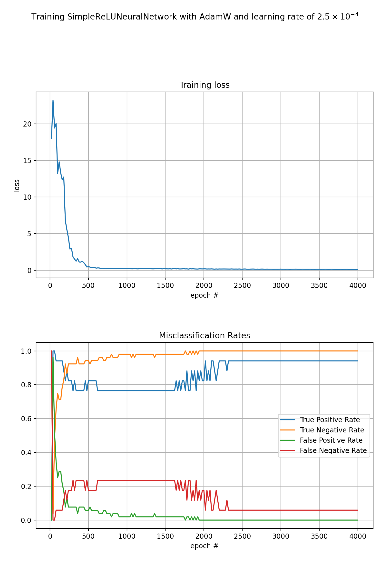

# PyTorch Models for EECS 836 Project

This repository contains the models described in our final report in a Jupyter notebook. No model in the notebook performed better than SimpleRELUNeuralNetwork, the training graph and confusion matrix values of which are displayed below.

